Android application that uses the Art Institute API to retrieve data about works of art including, date of creation, dimensions, country of origin, artwork title, artist's name, and other details.
Images can be zoomed in using the picasso library. App also informs users if they don't have an internet connection. Searched images are displayed in a recyclerView.

# Application Startup 
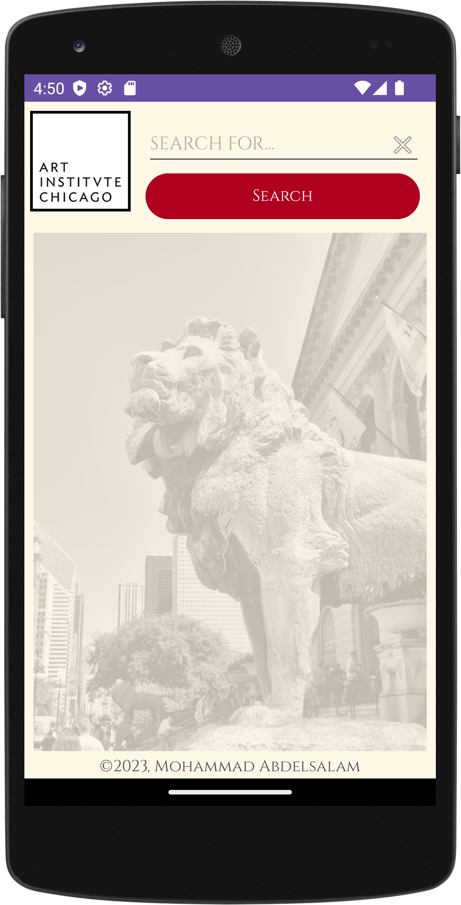

# Search Functionality
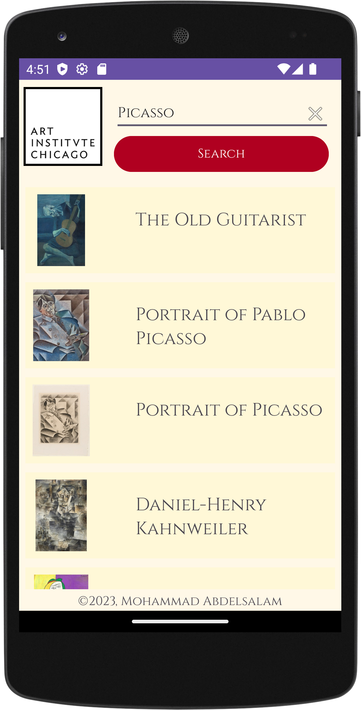

# Artwork Information Details
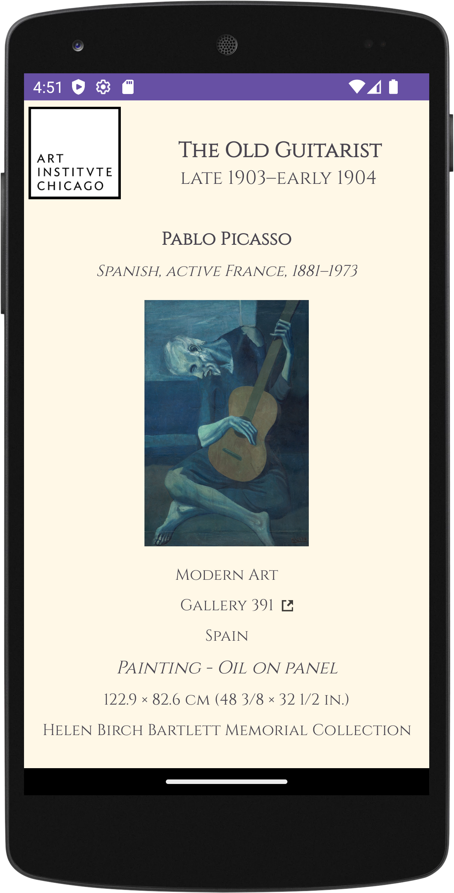

# Artwork Zoom-In
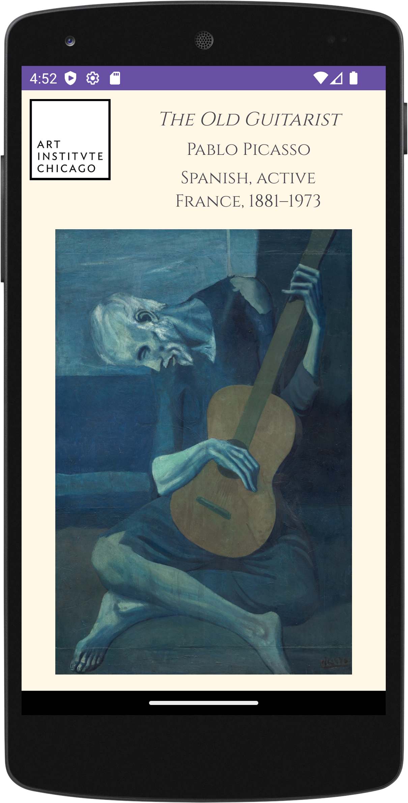
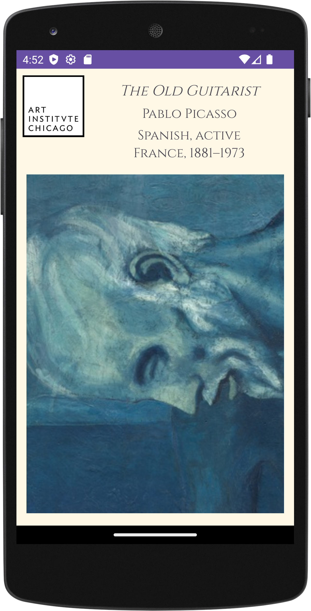
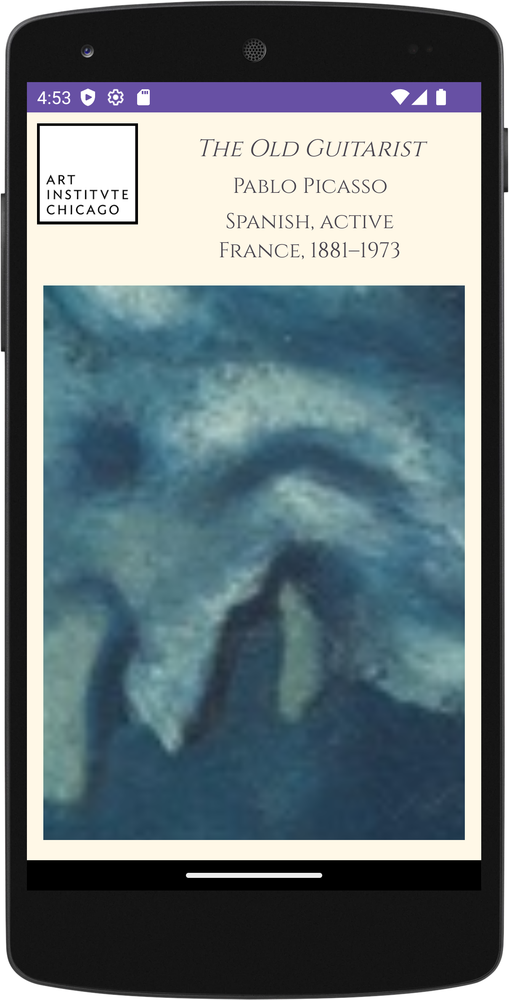

# Viewing Gallery Number Through Chrome
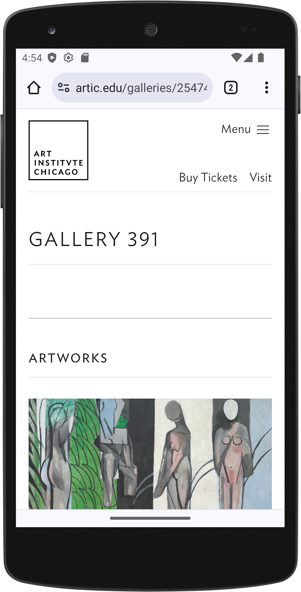
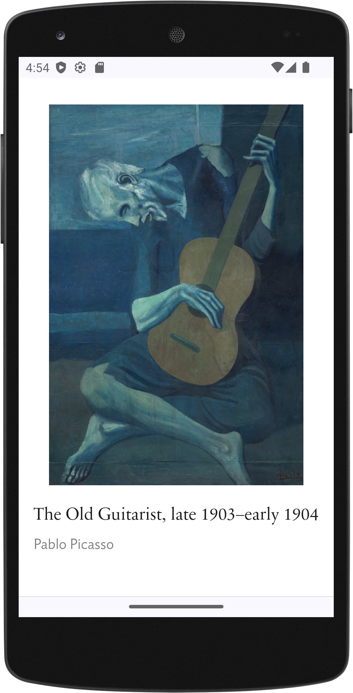

# Message Displayed If Internet Connection Not Found
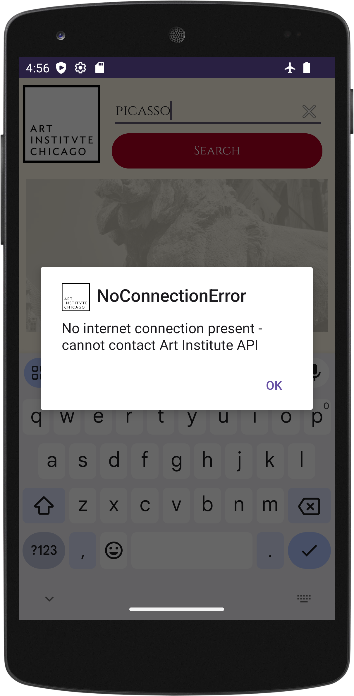

# Message Displayed If Search Input Is Too Short
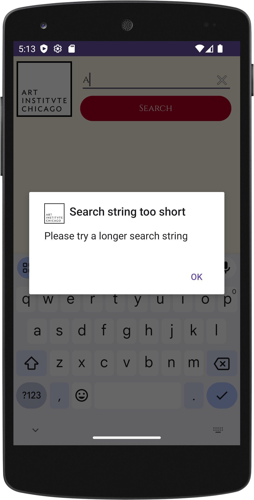

# Message Displayed If No Search Results Found
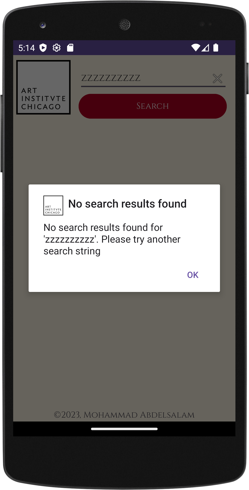

# Copyright Page
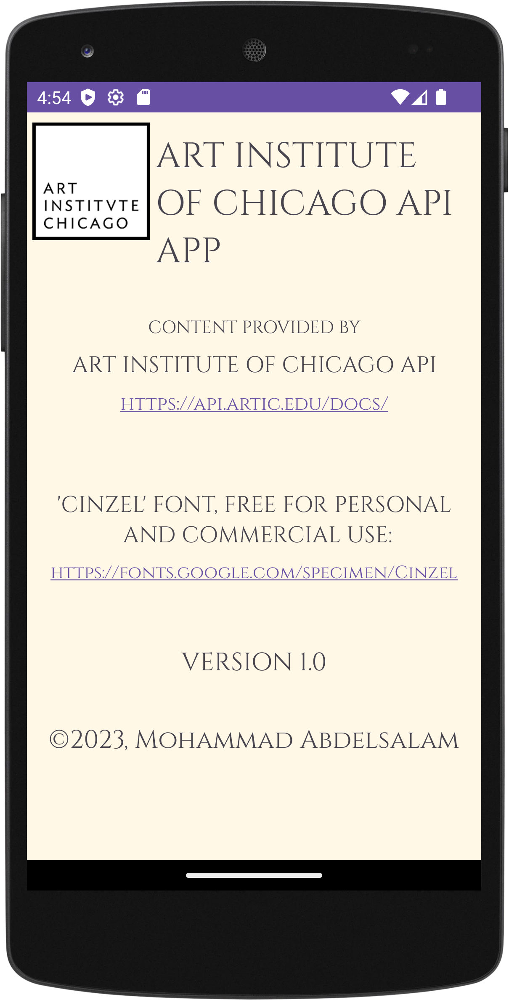

